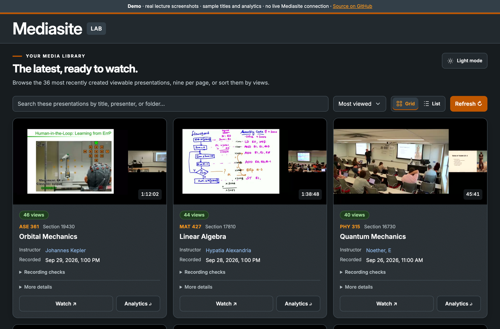

# Mediasite API Tester

A small Node app with a Vite + TypeScript front end for exploring the Mediasite REST API at
your server's `/Mediasite/Api/v1` address (set `MEDIASITE_BASE_URL`).

Current version: **0.1.0**. See the [changelog](CHANGELOG.md) for release notes.

- **API explorer** (`/`): send GET/POST/PUT/PATCH/DELETE requests, validate JSON bodies, revisit session request history, and copy or download formatted/raw responses.
- **Recent presentations** (`/recent`): the 100 most recently created viewable presentations, nine per page, with grid/list views, thumbnails, local search, sorting, refresh, watch links, and live analytics.
- **Smoke test** (`npm run smoke`): quick pass/fail check of key endpoints from the command line.



**Contents**

- [Quick start](#quick-start)
- [Using the app](#using-the-app)
- [Demo site](#demo-site-github-pages)
- [Analytics and shareable links](#viewing-analytics-and-shareable-links)
- [Security notes](#security-notes)
- [Development commands](#development-commands)

Requires Node 22.12 or newer. The browser uses native DOM APIs and CSS; Vite, TypeScript, and Prettier are development tools.

Typography uses a self-hosted Inter 4.1 variable font, with system fonts as a fallback
and monospace for API data. The font is bundled with the app, so browsers make no
requests to external font services. Its SIL Open Font License is included at
`frontend/public/fonts/OFL.txt`.

The interface uses [UT's brand palette](https://umac.utexas.edu/brand-center/colors/),
with `#bf5700` burnt orange for primary actions and charcoal/neutral surfaces for
dark mode. Inter remains the UI and card typeface. The primary horizontal university
wordmark in `frontend/public/brand/` comes from the
[Brand Center's official SVG](https://umac.utexas.edu/wp-content/themes/bellmont/dist/images/utexas-primary-horizontal-logo.svg).
Its vector paths and proportions are preserved; the dark-mode asset uses the
[permitted white reverse](https://brand.utexas.edu/identity/logos/).

## Quick start

You need **[Node.js](https://nodejs.org/) 22.12+** (includes npm), **Git**, and a
Mediasite API key plus username/password. Your account needs **API Access** and
permission to read your presentations; browser SSO alone is not enough.

### 1. Install

```sh
git clone https://github.com/mtmangum/mediasite.git
cd mediasite
npm ci
cp .env.example .env
```

Already have a checkout? Run the last two commands in the folder containing
`package.json`. On PowerShell, use `Copy-Item .env.example .env` to copy the file.

### 2. Get an API key

1. Open `https://YOUR-SERVER/Mediasite/Api/Docs/ApiKeyRegistration.aspx`. Adjust the installation path for your server.
2. Sign in as an administrator, enter an application name, and click **Submit**.
3. Copy the generated key. If you lack access, ask your Mediasite administrator for a key and an API account.

See [Mediasite's official guide](https://learn.mediasite.com/course/getting-started-with-mediasite-api/lessons/setting-up-an-api-key/).

### 3. Configure

Edit `.env` with your connection details:

```dotenv
MEDIASITE_BASE_URL=https://YOUR-SERVER/Mediasite/Api/v1
MEDIASITE_USERNAME="your-api-username"
MEDIASITE_PASSWORD="your-api-password"
MEDIASITE_API_KEY="your-generated-api-key"
PORT=3000
```

There is no default server; set `MEDIASITE_BASE_URL` to your own `https` address. Keep `.env`
private (it is gitignored), and restart the app after changing it.

### 4. Run

```sh
npm run dev
```

Open **[Presentations](http://localhost:3000/recent)** or the
**[API explorer](http://localhost:3000)**. Leave the terminal running; **Ctrl+C** stops
it. Use `npm start` to build and serve without live reload.

**Check access:** in the explorer, send GET `/Presentations?$top=3&$select=full`.
Expect `200` with items in `value`. `npm run smoke` also checks your `.env` connection,
but can pass with no visible recordings.

**Optional previews:** install [FFmpeg](https://ffmpeg.org/download.html) and check
`ffmpeg -version`. If needed, set `FFMPEG_PATH="/path/to/ffmpeg"` in `.env`.
**No credentials yet?** Try the [sample-data demo](#demo-site-github-pages).

### Common issues

| Problem                              | Fix                                                                            |
| ------------------------------------ | ------------------------------------------------------------------------------ |
| Port in use                          | Set `PORT=3100` in `.env`, restart, and open `http://localhost:3100`.          |
| `401` / `403` or empty library       | Check key, login, API Access, and content permissions with your administrator. |
| Timeout / login page instead of JSON | Check VPN/network access and the API URL ending in `/Api/v1`.                  |
| Build fails                          | Check `node --version` is 22.12+ and run `npm ci`.                             |

## Development commands

| Command                | Purpose                                  |
| ---------------------- | ---------------------------------------- |
| `npm run build`        | Type-check and build into `dist/`        |
| `npm test`             | Run tests against a local fake Mediasite |
| `npm run typecheck`    | Check TypeScript                         |
| `npm run format:check` | Check formatting                         |
| `npm run format`       | Apply formatting                         |
| `npm run smoke`        | Check the configured Mediasite API       |

Restart the dev server after backend or Vite configuration changes.

## Using the app

### Browse presentations

Open **Presentations** to see the latest 100 viewable recordings, nine per page.

- **Search** by title, presenter, folder, or description. Search and sorting apply to all loaded recordings.
- **Sort** by newest, title, views, or duration. Changing search or sort returns to page one.
- **Grid / List** changes the layout while keeping your page, search, and sort. Your browser remembers the layout.
- **Watch** opens the recording; **More details** shows additional metadata.
- Use the page numbers or **Previous / Next** below the recordings to browse.
- **Refresh** reloads the library. A **new recording available** banner lets you load new arrivals with **Show**.

View-count badges use these colors:

| Views | 0   | 1–5    | 6–10   | 11–20 | 21+   |
| ----- | --- | ------ | ------ | ----- | ----- |
| Color | Red | Orange | Yellow | Lime  | Green |

### View analytics

- **Grid:** select **Analytics** to flip a card and see its summary; select **Viewing charts** for the full charts.
- **List:** select **Analytics** to open the charts directly.
- Charts show engagement along the recording, views by day, viewing times, watch duration, and audience.
- Hover or tap charts to inspect values, or expand **View exact counts** for a table.
- Use **Refresh** on the card or **Refresh charts** in the dialog to update cached results.
- Select **Copy link** to share the chart URL. Press **Escape** or **Close** to return.

Missing metrics appear as a dash. Sessions are not unique viewers, and watch time
includes replays. Viewer names, IP addresses, and playback tickets are not sent to
the browser. See [analytics and shareable links](#viewing-analytics-and-shareable-links) for more detail.

### Preview and check recordings

Hover over a thumbnail to cycle through sampled frames, or use its preview button
to step manually. On touch screens the button stays visible; reduced-motion settings
disable automatic cycling. Original thumbnails remain visible when previews are unavailable.

Expand **Recording checks** to see the evidence behind a warning:

| Warning                  | Meaning                                                          |
| ------------------------ | ---------------------------------------------------------------- |
| **Under 20 min**         | A short recording worth reviewing; live recordings are excluded. |
| **Audio not verified**   | Waveform metadata is missing; this does not confirm silence.     |
| **Blank sampled frames** | All three sampled frames are dark or visually blank.             |
| **Little visual change** | The sampled frames are almost identical across the whole frame.  |

Checks run as you browse, not as a scheduled audit of the library. Visual flags are
screening signals: watch and listen to the recording before drawing conclusions.
Previews require FFmpeg and downloadable media; external videos skip local-file checks.

### Use the API explorer

Open **API explorer**, choose an endpoint, and select **Send request**. It is read-only
by default; enabling **Allow changes** permits requests that modify real Mediasite data.

To change accounts, expand **Connection** and select **Apply settings**. Changes last
until restart; blank password/key fields retain the current secrets. Request history
resets when you reload the page.

<details>
<summary>Preview and recording-check implementation details</summary>

File checks inspect completed audio/video for the current revision, including file
size and duration. Health checks run two at a time and are cached for five minutes.

Previews sample video near 35%, 50%, and 70%, favor detailed frames, and cycle every
1.5 seconds. Visual-change checks compare frames at 192×108 grayscale and flag less
than 1% noticeable pixel change. Extraction runs one job at a time with up to 24 MiB
of HTTP range reads per recording. Images are cached under `.cache/thumbnails` for
seven days, up to 100 recordings, scoped by credentials and media revision.
Mediasite's original thumbnails remain unchanged.

</details>

## About view counts

The presentation list's `NumberOfViews` is a lagging roll-up: new recordings read 0 for
days even when they are being watched. The cards therefore show `TotalViews` from each
presentation's `PresentationAnalytics` record, the same number as the back of the card.
`/PresentationAnalytics` ignores `$filter` and `$orderby` and fails on `or` filters, so
totals are looked up one presentation at a time (eight in parallel, visible cards first),
cached on the server for five minutes, and bypassed by the **Refresh** button. A shimmering
placeholder stands in until each count arrives; if a lookup fails, the list's count is used.

## Demo site (GitHub Pages)

`npm run build:demo` builds a static copy of the presentations page into `dist-demo/` that
runs entirely in the browser with bundled real lecture screenshots and sample data
(fictional titles, people, and analytics; no live Mediasite connection or credentials).
Screenshots are illustrative and do not correspond to the fictional course metadata. The API
explorer is local-only and is not part of the public site. `npm run preview:demo`
serves it at http://localhost:4173/mediasite/. The sub-path comes from `DEMO_BASE` (default
`/mediasite/`).

To publish it, enable **Settings → Pages → Build and deployment → Source: GitHub Actions**
on the repository. After that every push to `main` runs `.github/workflows/pages.yml`
(format check, tests, demo build, deploy) and the site appears at
`https://<user>.github.io/<repo>/` (the presentations page; `/recent` is the same page). Shareable chart links work there through a `404.html`
copy of the app, which GitHub Pages serves for unknown paths.

## Viewing analytics and shareable links

Open **Viewing charts** from the back of a grid card, or **Analytics** from a list row. The dialog shows headline numbers, a few
plain-language observations, and charts for engagement across the recording, views by day,
when people watch (in your time zone), how long people stay, and the audience. Hover or tap
a chart to read it; every chart has a "View exact counts" table. Sessions are summarized on
the server without identities: device class, open time, watch time and coverage, plus counts
of distinct and returning viewers by network address (all viewing here is anonymous, so
Mediasite's own "unique users" is always 1).

Each presentation's charts have a URL: `/recent/<presentation-id>/charts`. Opening the
dialog sets it, **Copy link** copies it, Back and Forward move between the list and the
charts, and a link to an older recording (outside the latest 100) works too.

## New recordings

The page does not poll constantly: every three minutes (and when a tab that was hidden for
a while becomes visible) it quietly fetches the list again. If there are recordings it
has not shown yet, a prompt offers them; nothing moves until you click **Show**. The
**Refresh** button reloads immediately. Add `?poll=10` to the URL to check every ten
seconds while testing.

## Security notes

The local server holds your Mediasite login and API key and calls Mediasite on your behalf,
so it is built to be reachable only by this app's own pages:

- It listens on `127.0.0.1` only, and answers only requests addressed to `localhost`,
  `127.0.0.1`, or `[::1]` on its own port, which defeats DNS-rebinding pages.
- Cross-site requests (anything a browser labels `Sec-Fetch-Site` other than `same-origin`
  or `none`, or with a foreign `Origin`) are refused, and writes must be `application/json`.
- A new base URL must be `https://` (or `http://` for localhost) with no embedded login,
  because your credentials are sent to it. Credentials are never returned to the browser.
- Responses are sent with `X-Frame-Options: DENY`, `nosniff`, and `no-referrer`.

The API explorer is **read-only by default**: only `GET` can be selected until you switch on
**Allow changes** (it resets on every page load). With the switch on, `POST`, `PUT`, `PATCH`,
and `DELETE` are sent to Mediasite with your real credentials and can modify or delete data,
so use an account with only the permissions you want it to have. The server enforces this too:
it refuses any write the page has not explicitly allowed. The GitHub Pages demo does not
include the explorer and never contacts Mediasite.

## What needs which credentials

| Endpoint                    | Anonymous | API key only          | API key + login |
| --------------------------- | --------- | --------------------- | --------------- |
| `/Home`, `/$metadata`       | yes       | yes                   | yes             |
| `/Presentations`            | 401       | returns an empty list | yes             |
| `/Folders`, `/UserProfiles` | 401       | 401                   | yes             |

## Notes on the API

- `/Presentations` returns only `Id`, `Title` and `Status` by default. Add `$select=full`
  to get description, dates, duration, owner, thumbnail URL and so on.
- Duration is in milliseconds.
- Scheduled recordings (`Status` of `Record`) have no media or thumbnail yet. The recent
  page filters to `Status eq 'Viewable'`.
- Thumbnails are fetched through the local `/thumb` route, which adds credentials and only
  allows the configured Mediasite host.

## Files

Back end (Node, no dependencies):

- `server.js` — entry point: shared state, route dispatch, static files, optional Vite dev middleware
- `routes/` — one module per concern: `connection.js` (`/config`, `/request`), `presentations.js` (`/recent.json`, `/presentation.json?id=…`, `/thumb`), `analytics.js` (`/analytics.json`, `/viewing.json`), `views.js` (`/views.json?ids=…`), `health.js` (`/health.json`), `previews.js` (`/preview.json`, `/preview`)
- `static.js` / `http-utils.js` — static file serving and request/response helpers
- `mediasite.js` — connection config, auth headers (`authHeaders`), and request helper
- `thumbnails.js` — bounded frame extraction, visual review signals, and local preview caching
- `recording-health.js` — duration, current media, and audio-waveform checks
- `analytics.js` — aggregate analytics requests and normalization
- `smoke-test.js` — CLI checks

Front end (Vite + TypeScript):

- `frontend/index.html` / `frontend/recent.html` — accessible page markup
- `frontend/src/explorer.ts` — API explorer page
- `frontend/src/presentations.ts` — presentations page: loading, rendering, paging, and event wiring
- `frontend/src/list.ts` — pure filtering, sorting, and pagination
- `frontend/src/cards.ts` — card markup, view-count tiers, skeleton placeholders
- `frontend/src/pagination.ts` — page-status and page-button markup
- `frontend/src/health.ts` / `previews.ts` / `analytics.ts` / `live-views.ts` — per-card recording checks, frame previews, analytics, and live view totals
- `frontend/src/viewing-charts.ts` / `viewing-stats.ts` — viewing analytics charts, and the pure statistics behind them
- `frontend/src/route.ts` — shareable chart-link URLs (base-path aware)
- `frontend/src/demo-api.ts` / `demo-install.ts` / `demo-hook.ts` — the demo build's built-in sample API and the switch that installs it
- `vite.demo.config.mjs` / `.github/workflows/pages.yml` — the static demo build and its GitHub Pages deployment
- `frontend/src/shared.ts` / `format.ts` / `http.ts` / `store.ts` — shared types, formatting and escaping, JSON fetch helpers, loaded-list state
- `frontend/src/style.css` — imports `frontend/src/styles/*.css` in cascade order (base, layout, explorer, list, cards, responsive, card-flip, analytics, dialog, charts, card-extras, loading)
- `vite.config.mjs` / `tsconfig.json` — build and strict type-check settings
